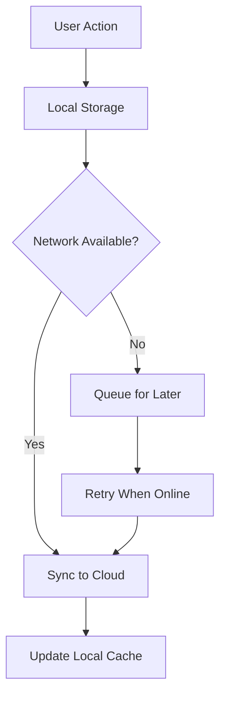

# PMI Tree Tracker

A comprehensive Flutter-based mobile application designed for Project Management Institute (PMI) Kenya's tree planting initiatives. This app enables teams to record, track, and monitor tree planting activities across Kenya, with features for growth monitoring, verification, and reporting.


## 📱 Features Overview

### Core Functionality
- **Tree Planting Records**: Add and manage tree planting activities with photos, GPS coordinates, and team information
- **Growth Tracking**: Monitor tree progress with periodic updates, photos, and health assessments
- **Interactive Maps**: Visualize planted trees on both Google Maps and Azure Maps with filtering capabilities
- **Team Management**: Organize planting activities by teams (Green Warriors, Eco Builders, Forest Friends, Tree Troopers)
- **Verification System**: Mark trees as verified for quality assurance
- **Comprehensive Reporting**: Generate detailed reports by species, teams, and time periods
- **Offline Support**: Continue working without internet connectivity with automatic sync when online

### User Experience
- **Responsive Design**: Clean, modern Material Design 3 interface
- **Real-time Notifications**: Stay updated on sync status and important events
- **Photo Gallery**: View and manage photos associated with each tree planting
- **Search & Filter**: Quickly find specific trees or plantings using various criteria
- **Dashboard Analytics**: Visual overview of planting progress and statistics

## 🏗️ Architecture Overview

### Frontend Architecture

The application follows a **Model-View-ViewModel (MVVM)** pattern with Flutter:

```
lib/
├── main.dart                 # Application entry point
├── models/                   # Data models
│   └── tree_models.dart     # Tree, Project, User, GrowthUpdate models
├── screens/                  # UI screens
│   ├── splash_screen.dart
│   ├── login_screen.dart
│   ├── home_page.dart
│   ├── dashboard_screen.dart
│   ├── add_tree_screen.dart
│   ├── tree_detail_screen.dart
│   ├── growth_update_screen.dart
│   ├── azure_map_screen.dart
│   ├── map_screen.dart
│   ├── reports_screen.dart
│   └── notification_screen.dart
├── view_models/              # Business logic layer
│   ├── tree_view_model.dart
│   ├── user_view_model.dart
│   └── project_view_model.dart
├── services/                 # Data and external services
│   ├── tree_service.dart
│   ├── dataverse_service.dart
│   ├── azure_maps_service.dart
│   ├── photo_service.dart
│   ├── user_service.dart
│   ├── notification_service.dart
│   ├── connectivity_service.dart
│   └── sync_service.dart
├── widgets/                  # Reusable UI components
│   ├── pmi_custom_bottom_bar.dart
│   ├── pmi_app_drawer.dart
│   ├── azure_maps_widget.dart
│   ├── photo_viewer_widgets.dart
│   └── connectivity_widgets.dart
└── utils/                    # Utilities and helpers
    ├── pmi_colors.dart
    └── file_utils.dart
```

### State Management
- **Provider Pattern**: Uses Flutter Provider for state management
- **ChangeNotifier**: ViewModels extend ChangeNotifier for reactive UI updates
- **Consumer Widgets**: UI screens consume state changes via Consumer widgets

### Data Layer Architecture

#### Local Storage
- **SharedPreferences**: Stores user preferences, authentication tokens, and cached data
- **Local File System**: Manages photos and offline data storage
- **JSON Serialization**: Data models support to/from JSON conversion for persistence

#### Cloud Integration
- **Microsoft Dataverse**: Primary backend for production data storage
- **Azure Maps**: Geospatial services and mapping functionality
- **REST APIs**: HTTP-based communication with backend services

### Backend Services

#### Microsoft Dataverse Integration
```dart
class DataverseService {
  // OAuth 2.0 authentication with Azure AD
  // CRUD operations for tree data
  // Batch synchronization capabilities
  // Offline-first with cloud sync
}
```

**Key Features:**
- OAuth 2.0 authentication with Microsoft Azure AD
- RESTful API calls with proper error handling
- Automatic token refresh and management
- Offline-first architecture with periodic synchronization
- Batch data operations for efficiency

#### Data Models

**Tree Model:**
```dart
class Tree {
  final String id;
  final String species;
  final String location;
  final int quantity;
  final DateTime plantingDate;
  final String planterId;
  final String? photoUrl;
  final bool isVerified;
  final String? teamName;
  final double? latitude;
  final double? longitude;
  final List<GrowthUpdate> growthUpdates;
}
```

**Growth Update Model:**
```dart
class GrowthUpdate {
  final String id;
  final DateTime date;
  final String notes;
  final String? photoUrl;
  final double? heightCm;
  final String? healthStatus; // good, fair, poor
}
```

## 🛠️ Technology Stack

### Frontend
- **Flutter 3.6.1**: Cross-platform mobile development framework
- **Dart 3.6.1**: Programming language
- **Material Design 3**: UI design system
- **Provider 6.1.1**: State management solution

### Key Dependencies
```yaml
dependencies:
  # Core Flutter
  flutter:
    sdk: flutter
  cupertino_icons: ^1.0.8
  
  # State Management & Architecture
  provider: ^6.1.1
  
  # Networking & APIs
  http: ^1.1.0
  
  # Maps & Location
  google_maps_flutter: ^2.5.0
  geolocator: ^10.1.0
  
  # Local Storage
  shared_preferences: ^2.2.2
  path_provider: ^2.1.2
  
  # Media & Images
  image_picker: ^1.0.4
  camera: ^0.10.5+9
  flutter_image_compress: ^2.1.0
  photo_view: ^0.14.0
  
  # UI & UX
  flutter_svg: ^2.0.10
  cached_network_image: ^3.3.1
  intl: ^0.19.0
  
  # Connectivity & Sync
  connectivity_plus: ^5.0.2
  
  # Web Views (for Azure Maps)
  webview_flutter: ^4.7.0
  webview_flutter_android: ^3.0.0
  webview_flutter_wkwebview: ^3.0.0
  
  # Utilities
  uuid: ^4.3.3
```

### Backend Services
- **Microsoft Dataverse**: Cloud database and API platform
- **Azure Maps**: Mapping and geospatial services
- **Azure Active Directory**: Authentication and authorization
- **REST APIs**: Standard HTTP-based communication

## 📊 Features Deep Dive

### 1. Tree Planting Management
- **Add Trees**: Record new plantings with species, location, quantity, team, and photos
- **GPS Integration**: Automatic location capture with manual override option
- **Photo Capture**: Built-in camera functionality with gallery selection
- **Team Assignment**: Associate plantings with specific teams
- **Validation**: Form validation and required field enforcement

### 2. Growth Monitoring
- **Progress Updates**: Record tree growth with photos and measurements
- **Health Assessment**: Track tree health status (good, fair, poor)
- **Photo Timeline**: Visual progression of tree growth over time
- **Measurement Tracking**: Height and other growth metrics
- **Notes System**: Detailed observations and comments

### 3. Interactive Mapping
- **Dual Map Support**: Both Google Maps and Azure Maps integration
- **Tree Visualization**: Display all planted trees as map markers
- **Filtering**: Filter by species, verification status, team, and date range
- **Location Search**: Search for specific locations
- **Offline Maps**: Cached map data for offline viewing

### 4. Verification System
- **Quality Control**: Mark trees as verified by authorized personnel
- **Status Tracking**: Visual indicators for verification status
- **Verification Reports**: Generate reports on verification progress
- **Audit Trail**: Track who verified each tree and when

### 5. Comprehensive Reporting
- **Summary Reports**: Overview statistics and key metrics
- **Species Analysis**: Breakdown by tree species with visualizations
- **Team Performance**: Track performance by planting teams
- **Date Range Filtering**: Customize reports for specific time periods
- **Export Functionality**: Download reports for external use

### 6. Offline Capabilities
- **Offline Data Storage**: Continue adding trees without internet
- **Photo Caching**: Store photos locally until sync
- **Automatic Sync**: Seamless data synchronization when online
- **Conflict Resolution**: Handle data conflicts during sync
- **Sync Status**: Real-time sync progress indicators

## 🚀 Installation & Setup

### Prerequisites
- Flutter SDK 3.6.1 or higher
- Dart SDK 3.6.1 or higher
- Android Studio / VS Code with Flutter extensions
- Android SDK (for Android development)
- Xcode (for iOS development)

### Local Development Setup

1. **Clone the Repository**
   ```bash
   git clone https://github.com/pmi-kenya/tree-tracker.git
   cd tree-tracker
   ```

2. **Install Dependencies**
   ```bash
   flutter pub get
   ```

3. **Configure Environment**
   - Copy `lib/config/env.example.dart` to `lib/config/env.dart`
   - Update configuration values for your environment

4. **Set Up Maps API Keys**
   
   **For Google Maps:**
   - Add your Google Maps API key to `android/app/src/main/AndroidManifest.xml`:
   ```xml
   <meta-data
       android:name="com.google.android.geo.API_KEY"
       android:value="YOUR_GOOGLE_MAPS_API_KEY" />
   ```
   
   **For Azure Maps:**
   - Update `lib/services/azure_maps_service.dart` with your subscription key:
   ```dart
   final String _subscriptionKey = 'YOUR_AZURE_MAPS_SUBSCRIPTION_KEY';
   ```

5. **Configure Dataverse (Optional)**
   - Update `lib/services/dataverse_service.dart` with your Dataverse configuration:
   ```dart
   final String _baseUrl = 'https://your-instance.api.crm.dynamics.com/api/data/v9.2';
   final String _clientId = 'your_client_id';
   final String _clientSecret = 'your_client_secret';
   final String _tenantId = 'your_tenant_id';
   ```

6. **Run the Application**
   ```bash
   flutter run
   ```

### Production Deployment

1. **Build for Android**
   ```bash
   flutter build apk --release
   # or for app bundle
   flutter build appbundle --release
   ```

2. **Build for iOS**
   ```bash
   flutter build ios --release
   ```

## 🔧 Configuration

### Environment Configuration
The app supports multiple environments (development, staging, production). Configure environment-specific settings in:

- `lib/config/env.dart` - Environment variables
- `lib/services/dataverse_service.dart` - Backend API endpoints
- `lib/services/azure_maps_service.dart` - Maps configuration

### Feature Flags
Toggle features using boolean flags in the service classes:

```dart
// In DataverseService
bool useDataverse = false; // Set to true in production

// In various screens
bool enableOfflineMode = true;
bool enableMapFiltering = true;
```

## 📱 User Interface

### Design System
- **Material Design 3**: Modern, accessible design language
- **PMI Brand Colors**: Custom color scheme aligned with PMI Kenya branding
- **Responsive Layout**: Adaptive design for various screen sizes
- **Dark/Light Mode**: System-adaptive theming

### Key UI Components
- **Custom Bottom Navigation**: PMI-branded navigation bar
- **Interactive Cards**: Status cards with animations and interactions
- **Form Controls**: Consistent input fields with validation
- **Photo Viewers**: Full-screen photo viewing with zoom capabilities
- **Loading States**: Elegant loading indicators and progress bars

### Accessibility
- **Screen Reader Support**: Semantic labels and descriptions
- **Color Contrast**: WCAG-compliant color combinations
- **Font Scaling**: Support for dynamic text sizing
- **Keyboard Navigation**: Full keyboard accessibility

## 🔄 Data Flow & Synchronization

### Offline-First Architecture
1. **Local Storage**: All data is stored locally first using SharedPreferences and file system
2. **Background Sync**: Automatic synchronization when network is available
3. **Conflict Resolution**: Timestamp-based conflict resolution for data conflicts
4. **Progress Tracking**: Real-time sync status with progress indicators

### Data Synchronization Flow


## 📈 Analytics & Reporting

### Dashboard Metrics
- **Total Trees Planted**: Aggregate count across all activities
- **Active Projects**: Number of ongoing planting initiatives
- **Verification Status**: Percentage of verified vs. pending trees
- **Team Performance**: Ranking and statistics by team

### Report Types
1. **Summary Reports**: High-level overview with key performance indicators
2. **Species Reports**: Detailed breakdown by tree species with charts
3. **Team Reports**: Performance analysis by planting teams
4. **Temporal Reports**: Trends over time with date range filtering

### Data Visualization
- **Bar Charts**: Monthly planting trends and team comparisons
- **Progress Indicators**: Visual progress bars for various metrics
- **Map Visualizations**: Geographic distribution of plantings
- **Status Badges**: Quick visual indicators for verification status

## 🔐 Security & Privacy

### Authentication
- **OAuth 2.0**: Secure authentication with Microsoft Azure AD
- **Token Management**: Automatic token refresh and secure storage
- **Session Management**: Secure session handling with proper logout

### Data Security
- **Encrypted Storage**: Sensitive data encrypted at rest
- **HTTPS Communication**: All API calls use secure HTTPS
- **Input Validation**: Comprehensive validation to prevent injection attacks
- **Error Handling**: Secure error messages without exposing sensitive information

### Privacy
- **Data Minimization**: Only collect necessary data for functionality
- **Photo Permissions**: Explicit user consent for camera and storage access
- **Location Privacy**: GPS data used only for tree location tracking
- **Data Retention**: Clear policies on data storage and deletion

## 🧪 Testing Strategy

### Test Types
- **Unit Tests**: Core business logic and utility functions
- **Widget Tests**: UI component testing and interaction testing
- **Integration Tests**: End-to-end user flow testing
- **Golden Tests**: Visual regression testing for UI consistency

### Testing Framework
```bash
# Run all tests
flutter test

# Run tests with coverage
flutter test --coverage

# Run integration tests
flutter drive --target=test_driver/app.dart
```

## 🚀 Performance Optimization

### App Performance
- **Lazy Loading**: Load data and images only when needed
- **Image Compression**: Automatic image optimization for storage and network
- **Caching Strategy**: Intelligent caching of frequently accessed data
- **Memory Management**: Proper disposal of controllers and streams

### Network Optimization
- **Batch Operations**: Group API calls to reduce network requests
- **Data Compression**: Compressed payloads for faster transfers
- **Connection Pooling**: Efficient HTTP connection management
- **Retry Logic**: Smart retry mechanisms for failed requests

## 🛠️ Development Workflow

### Git Workflow
```bash
# Feature development
git checkout -b feature/tree-growth-tracking
git commit -m "Add growth update functionality"
git push origin feature/tree-growth-tracking

# Create pull request for code review
```

### Code Quality
- **Linting**: Dart analyzer with custom rules
- **Code Formatting**: Consistent formatting with dartfmt
- **Documentation**: Comprehensive inline documentation
- **Code Reviews**: Mandatory peer review process

### CI/CD Pipeline
- **Automated Testing**: Run all tests on every commit
- **Build Verification**: Ensure successful builds for all platforms
- **Code Quality Checks**: Automated linting and formatting verification
- **Deployment Automation**: Streamlined deployment to app stores

## 📚 API Documentation

### Tree Management APIs
```dart
// Add a new tree
POST /api/trees
{
  "species": "Acacia",
  "location": "Nairobi National Park",
  "quantity": 10,
  "teamName": "Green Warriors",
  "latitude": -1.2921,
  "longitude": 36.8219
}

// Get all trees
GET /api/trees?verified=true&species=Acacia

// Update tree verification
PATCH /api/trees/{id}
{
  "isVerified": true,
  "verifiedBy": "user123",
  "verificationDate": "2024-01-15T10:30:00Z"
}
```

### Growth Update APIs
```dart
// Add growth update
POST /api/trees/{treeId}/growth-updates
{
  "notes": "Tree showing healthy growth",
  "heightCm": 45.5,
  "healthStatus": "good",
  "photoUrl": "https://storage.example.com/photos/abc123.jpg"
}
```

## 🤝 Contributing

### Getting Started
1. Fork the repository
2. Create a feature branch
3. Make your changes
4. Add tests for new functionality
5. Submit a pull request

### Coding Standards
- Follow Dart/Flutter style guidelines
- Write meaningful commit messages
- Add documentation for public APIs
- Ensure test coverage for new features

### Pull Request Process
1. Update documentation for any new features
2. Ensure all tests pass
3. Request review from maintainers
4. Address feedback and make necessary changes

## 📄 License

This project is licensed under the MIT License - see the [LICENSE](LICENSE) file for details.

## 🆘 Support & Contact

### Technical Support
- **Email**: tech-support@pmi-kenya.org
- **Documentation**: [Project Wiki](https://github.com/pmi-kenya/tree-tracker/wiki)
- **Issues**: [GitHub Issues](https://github.com/pmi-kenya/tree-tracker/issues)

### Project Maintainers
- **Project Lead**: PMI Kenya Technical Team
- **Lead Developer**: [Developer Name]
- **DevOps**: [DevOps Team]

## 🗺️ Roadmap

### Upcoming Features
- [ ] **Advanced Analytics**: Machine learning-based growth predictions
- [ ] **QR Code Integration**: QR codes for individual tree tracking
- [ ] **Social Features**: Share achievements and progress on social media
- [ ] **Gamification**: Points, badges, and leaderboards for teams
- [ ] **API Integration**: Connect with forestry department databases
- [ ] **IoT Integration**: Support for IoT sensors on trees
- [ ] **Multi-language Support**: Swahili and other local languages

### Version History
- **v1.0.0**: Initial release with core functionality
- **v1.1.0**: Added Azure Maps integration
- **v1.2.0**: Enhanced reporting capabilities
- **v1.3.0**: Offline sync improvements
- **v2.0.0**: (Planned) Advanced analytics and IoT integration

---

**Built with ❤️ by PMI Kenya for a greener future 🌳**
